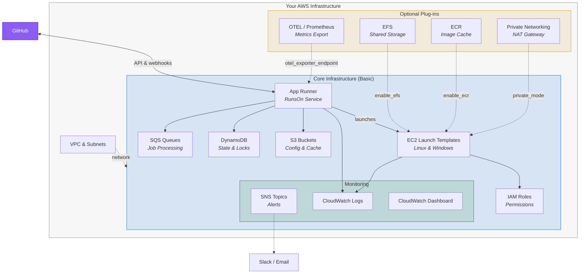

# RunsOn Terraform Module

Deploy [RunsOn](https://runs-on.com) self-hosted GitHub Actions runners on AWS with Terraform/OpenTofu.

## Usage

```hcl
terraform {
  required_version = ">= 1.6.0"

  required_providers {
    aws = {
      source  = "hashicorp/aws"
      version = "~> 6.0"
    }
  }
}

provider "aws" {
  region = "us-east-1"
}

# Get available AZs
data "aws_availability_zones" "available" {
  state = "available"
}

# VPC Module - Creates networking infrastructure
module "vpc" {
  source  = "terraform-aws-modules/vpc/aws"
  version = "~> 5.0"

  name = "runs-on-vpc"
  cidr = "10.0.0.0/16"

  azs             = slice(data.aws_availability_zones.available.names, 0, 3)
  private_subnets = ["10.0.1.0/24", "10.0.2.0/24", "10.0.3.0/24"]
  public_subnets  = ["10.0.101.0/24", "10.0.102.0/24", "10.0.103.0/24"]

  # NAT Gateway for private subnets (required for private networking)
  # enable_nat_gateway = true
  # single_nat_gateway = true

  enable_dns_hostnames = true
  enable_dns_support   = true
}

# RunsOn Module - Deploys RunsOn infrastructure with smart defaults
module "runs-on" {
  source  = "runs-on/runs-on/aws"
  version = "v2.10.0-r1"

  # Required: GitHub and License
  github_organization = "my-org"
  license_key         = "your-license-key"
  email               = "alerts@example.com"

  # Required: Network configuration (BYOV - Bring Your Own VPC)
  vpc_id             = module.vpc.vpc_id
  public_subnet_ids  = module.vpc.public_subnets
  private_subnet_ids = module.vpc.private_subnets
}
```
The module assumes you have your own VPC already configured.

> [!TIP]
Cost Estimates:
> - **RunsOn base:** ~$3/mo (App Runner)
> - **NAT Gateway:** ~$32/mo per gateway + data transfer charges (required for private networking)
> - **VPC Endpoints:** ~$7/mo per interface endpoint + data transfer charges (S3 gateway endpoint is free)
> - **EFS:** ~$0.30/GB-month for storage
> - **ECR:** ~$0.10/GB-month for storage
> - **Runners:** EC2 costs vary by instance type and usage (pay only for what you use)

# Architecture



# Examples

### Basic

Standard deployment with smart defaults:

```hcl
module "runs-on" {
  source  = "runs-on/runs-on/aws"
  version = "v2.10.0-r1"

  github_organization = "my-org"
  license_key         = "your-license-key"
  email               = "alerts@example.com"

  vpc_id            = "vpc-xxxxxxxx"
  public_subnet_ids = ["subnet-pub1", "subnet-pub2", "subnet-pub3"]
}
```

### Private Networking

Enable private networking for static egress IPs (requires NAT Gateway):

```hcl
module "runs-on" {
  source  = "runs-on/runs-on/aws"
  version = "v2.10.0-r1"

  github_organization = "my-org"
  license_key         = "your-license-key"
  email               = "alerts@example.com"

  vpc_id             = "vpc-xxxxxxxx"
  public_subnet_ids  = ["subnet-pub1", "subnet-pub2", "subnet-pub3"]
  private_subnet_ids = ["subnet-priv1", "subnet-priv2", "subnet-priv3"]

  # Private networking mode options:
  #   "false"  - Disabled (default)
  #   "true"   - Opt-in: runners can use private=true label
  #   "always" - Default with opt-out: runners use private by default
  #   "only"   - Forced: all runners must use private subnets
  private_mode = "true"
}
```

### EFS Enabled

Enable shared persistent storage across all runners for storing and sharing large files/artifacts:

```hcl
module "runs-on" {
  source  = "runs-on/runs-on/aws"
  version = "v2.10.0-r1"

  github_organization = "my-org"
  license_key         = "your-license-key"
  email               = "alerts@example.com"

  vpc_id            = "vpc-xxxxxxxx"
  public_subnet_ids = ["subnet-pub1", "subnet-pub2", "subnet-pub3"]

  # Enables persistent shared filesystem across all runners
  enable_efs = true
}
```

### ECR Enabled

Enable image cache across workflow jobs, including Docker build cache:

```hcl
module "runs-on" {
  source  = "runs-on/runs-on/aws"
  version = "v2.10.0-r1"

  github_organization = "my-org"
  license_key         = "your-license-key"
  email               = "alerts@example.com"

  vpc_id            = "vpc-xxxxxxxx"
  public_subnet_ids = ["subnet-pub1", "subnet-pub2", "subnet-pub3"]

  # Creates private ECR for build cache
  enable_ecr = true
}
```

### Full Featured

All features enabled together, with VPC endpoints for improved security and reduced data transfer costs:

```hcl
# VPC with endpoints for private connectivity
module "vpc" {
  source  = "terraform-aws-modules/vpc/aws"
  version = "~> 5.0"

  name = "runs-on-vpc"
  cidr = "10.0.0.0/16"

  azs             = ["us-east-1a", "us-east-1b", "us-east-1c"]
  private_subnets = ["10.0.1.0/24", "10.0.2.0/24", "10.0.3.0/24"]
  public_subnets  = ["10.0.101.0/24", "10.0.102.0/24", "10.0.103.0/24"]

  enable_nat_gateway = true
  single_nat_gateway = true # 'false' for High Availibility

  enable_dns_hostnames = true
  enable_dns_support   = true

  # VPC Endpoints 
  # Enable only if you're using private networking in RunsOn for full intra-VPC traffic to AWS APIs (avoids NAT Gateway data transfer costs).
  
  # S3 gateway endpoint is free and recommended
  enable_s3_endpoint = true
  
  # ECR endpoints are useful if you push/pull lots of images (enable_ecr = true)
  enable_ecr_api_endpoint     = false # For ECR API calls
  enable_ecr_dkr_endpoint     = false # For ECR image pulls

  # Interface endpoints below cost ~$7/mo each. 
  enable_ec2_endpoint         = false # For EC2 API calls
  enable_logs_endpoint        = false # For CloudWatch Logs
  enable_ssm_endpoint         = false # For SSM access
  enable_ssmmessages_endpoint = false # For SSM Session Manager
}

module "runs-on" {
  source  = "runs-on/runs-on/aws"
  version = "v2.10.0-r1"

  github_organization = "my-org"
  license_key         = "your-license-key"
  email               = "alerts@example.com"

  vpc_id             = module.vpc.vpc_id
  public_subnet_ids  = module.vpc.public_subnets
  private_subnet_ids = module.vpc.private_subnets

  # Private networking (opt-in mode)
  private_mode = "true"

  # EFS shared storage
  enable_efs = true

  # ECR container registry
  enable_ecr = true

  # CloudWatch dashboard for monitoring
  enable_dashboard = true
}
```

<!-- BEGIN_TF_DOCS -->


## Requirements

| Name | Version |
|------|---------|
| <a name="requirement_terraform"></a> [terraform](#requirement\_terraform) | >= 1.6.0 |
| <a name="requirement_aws"></a> [aws](#requirement\_aws) | >= 6.0 |
| <a name="requirement_time"></a> [time](#requirement\_time) | >= 0.9 |

## Providers

| Name | Version |
|------|---------|
| <a name="provider_aws"></a> [aws](#provider\_aws) | 6.24.0 |
| <a name="provider_time"></a> [time](#provider\_time) | 0.13.1 |

## Modules

| Name | Source | Version |
|------|--------|---------|
| <a name="module_compute"></a> [compute](#module\_compute) | ./modules/compute | n/a |
| <a name="module_core"></a> [core](#module\_core) | ./modules/core | n/a |
| <a name="module_optional"></a> [optional](#module\_optional) | ./modules/optional | n/a |
| <a name="module_storage"></a> [storage](#module\_storage) | ./modules/storage | n/a |

## Resources

| Name | Type |
|------|------|
| [aws_cloudformation_stack.runs_on_mock](https://registry.terraform.io/providers/hashicorp/aws/latest/docs/resources/cloudformation_stack) | resource |
| [aws_security_group.runners](https://registry.terraform.io/providers/hashicorp/aws/latest/docs/resources/security_group) | resource |
| [aws_vpc_security_group_egress_rule.all_ipv4](https://registry.terraform.io/providers/hashicorp/aws/latest/docs/resources/vpc_security_group_egress_rule) | resource |
| [aws_vpc_security_group_egress_rule.all_ipv6](https://registry.terraform.io/providers/hashicorp/aws/latest/docs/resources/vpc_security_group_egress_rule) | resource |
| [aws_vpc_security_group_ingress_rule.ssh](https://registry.terraform.io/providers/hashicorp/aws/latest/docs/resources/vpc_security_group_ingress_rule) | resource |
| [time_sleep.wait_for_nat](https://registry.terraform.io/providers/hashicorp/time/latest/docs/resources/sleep) | resource |

## Inputs

| Name | Description | Type | Default | Required |
|------|-------------|------|---------|:--------:|
| <a name="input_email"></a> [email](#input\_email) | Email address for alerts and notifications (requires confirmation) | `string` | n/a | yes |
| <a name="input_github_organization"></a> [github\_organization](#input\_github\_organization) | GitHub organization or username for RunsOn integration | `string` | n/a | yes |
| <a name="input_license_key"></a> [license\_key](#input\_license\_key) | RunsOn license key obtained from runs-on.com | `string` | n/a | yes |
| <a name="input_public_subnet_ids"></a> [public\_subnet\_ids](#input\_public\_subnet\_ids) | List of public subnet IDs for runner instances (requires at least 1) | `list(string)` | n/a | yes |
| <a name="input_vpc_id"></a> [vpc\_id](#input\_vpc\_id) | VPC ID where RunsOn infrastructure will be deployed | `string` | n/a | yes |
| <a name="input_alert_https_endpoint"></a> [alert\_https\_endpoint](#input\_alert\_https\_endpoint) | HTTPS endpoint for alert notifications (optional) | `string` | `""` | no |
| <a name="input_alert_slack_webhook_url"></a> [alert\_slack\_webhook\_url](#input\_alert\_slack\_webhook\_url) | Slack webhook URL for alert notifications (optional) | `string` | `""` | no |
| <a name="input_app_alarm_daily_minutes"></a> [app\_alarm\_daily\_minutes](#input\_app\_alarm\_daily\_minutes) | Daily budget in minutes for the App Runner service before triggering an alarm | `number` | `4000` | no |
| <a name="input_app_cpu"></a> [app\_cpu](#input\_app\_cpu) | CPU units for App Runner service (256, 512, 1024, 2048, 4096) | `number` | `256` | no |
| <a name="input_app_debug"></a> [app\_debug](#input\_app\_debug) | Enable debug mode for RunsOn stack (prevents auto-shutdown of failed runner instances) | `bool` | `false` | no |
| <a name="input_app_image"></a> [app\_image](#input\_app\_image) | App Runner container image for RunsOn service | `string` | `"public.ecr.aws/c5h5o9k1/runs-on/runs-on:v2.10.0"` | no |
| <a name="input_app_memory"></a> [app\_memory](#input\_app\_memory) | Memory in MB for App Runner service (512, 1024, 2048, 3072, 4096, 6144, 8192, 10240, 12288) | `number` | `512` | no |
| <a name="input_app_tag"></a> [app\_tag](#input\_app\_tag) | Application version tag for RunsOn service | `string` | `"v2.10.0"` | no |
| <a name="input_bootstrap_tag"></a> [bootstrap\_tag](#input\_bootstrap\_tag) | Bootstrap script version tag | `string` | `"v0.1.12"` | no |
| <a name="input_cache_expiration_days"></a> [cache\_expiration\_days](#input\_cache\_expiration\_days) | Number of days to retain cache artifacts in S3 before expiration | `number` | `10` | no |
| <a name="input_cost_allocation_tag"></a> [cost\_allocation\_tag](#input\_cost\_allocation\_tag) | Name of the tag key used for cost allocation and tracking | `string` | `"stack"` | no |
| <a name="input_default_admins"></a> [default\_admins](#input\_default\_admins) | Comma-separated list of default admin usernames | `string` | `""` | no |
| <a name="input_detailed_monitoring_enabled"></a> [detailed\_monitoring\_enabled](#input\_detailed\_monitoring\_enabled) | Enable detailed CloudWatch monitoring for EC2 instances (increases costs) | `bool` | `false` | no |
| <a name="input_ebs_encryption_enabled"></a> [ebs\_encryption\_enabled](#input\_ebs\_encryption\_enabled) | Enable encryption for EBS volumes on runner instances | `bool` | `false` | no |
| <a name="input_ebs_encryption_key_id"></a> [ebs\_encryption\_key\_id](#input\_ebs\_encryption\_key\_id) | KMS key ID for EBS volume encryption (leave empty for AWS managed key) | `string` | `""` | no |
| <a name="input_ec2_queue_size"></a> [ec2\_queue\_size](#input\_ec2\_queue\_size) | Maximum number of EC2 instances in queue | `number` | `2` | no |
| <a name="input_enable_cost_reports"></a> [enable\_cost\_reports](#input\_enable\_cost\_reports) | Enable automated cost reports sent to alert email | `bool` | `true` | no |
| <a name="input_enable_dashboard"></a> [enable\_dashboard](#input\_enable\_dashboard) | Create a CloudWatch dashboard for monitoring RunsOn operations (number of jobs processed, rate limit status, last error messages, etc.) | `bool` | `true` | no |
| <a name="input_enable_ecr"></a> [enable\_ecr](#input\_enable\_ecr) | Enable ECR repository for ephemeral Docker image storage | `bool` | `false` | no |
| <a name="input_enable_efs"></a> [enable\_efs](#input\_enable\_efs) | Enable EFS file system for shared storage across runners | `bool` | `false` | no |
| <a name="input_environment"></a> [environment](#input\_environment) | Environment name used for resource tagging and RunsOn job filtering. RunsOn will only process jobs with an 'env' label matching this value. See https://runs-on.com/configuration/environments/ for details. | `string` | `"production"` | no |
| <a name="input_force_delete_ecr"></a> [force\_delete\_ecr](#input\_force\_delete\_ecr) | Allow ECR repository to be deleted even when it contains images. Set to true for testing environments. | `bool` | `false` | no |
| <a name="input_force_destroy_buckets"></a> [force\_destroy\_buckets](#input\_force\_destroy\_buckets) | Allow S3 buckets to be destroyed even when not empty. Set to false for production environments to prevent accidental data loss. | `bool` | `false` | no |
| <a name="input_github_api_strategy"></a> [github\_api\_strategy](#input\_github\_api\_strategy) | Strategy for GitHub API calls (normal, conservative) | `string` | `"normal"` | no |
| <a name="input_github_enterprise_url"></a> [github\_enterprise\_url](#input\_github\_enterprise\_url) | GitHub Enterprise Server URL (optional, leave empty for github.com) | `string` | `""` | no |
| <a name="input_integration_step_security_api_key"></a> [integration\_step\_security\_api\_key](#input\_integration\_step\_security\_api\_key) | API key for StepSecurity integration (optional) | `string` | `""` | no |
| <a name="input_ipv6_enabled"></a> [ipv6\_enabled](#input\_ipv6\_enabled) | Enable IPv6 support for runner instances | `bool` | `false` | no |
| <a name="input_log_retention_days"></a> [log\_retention\_days](#input\_log\_retention\_days) | Number of days to retain CloudWatch logs for EC2 instances | `number` | `7` | no |
| <a name="input_logger_level"></a> [logger\_level](#input\_logger\_level) | Logging level for RunsOn service (debug, info, warn, error) | `string` | `"info"` | no |
| <a name="input_otel_exporter_endpoint"></a> [otel\_exporter\_endpoint](#input\_otel\_exporter\_endpoint) | OpenTelemetry exporter endpoint for observability (optional) | `string` | `""` | no |
| <a name="input_otel_exporter_headers"></a> [otel\_exporter\_headers](#input\_otel\_exporter\_headers) | OpenTelemetry exporter headers (optional) | `string` | `""` | no |
| <a name="input_permission_boundary_arn"></a> [permission\_boundary\_arn](#input\_permission\_boundary\_arn) | IAM permissions boundary ARN to attach to all IAM roles (optional) | `string` | `""` | no |
| <a name="input_prevent_destroy_optional_resources"></a> [prevent\_destroy\_optional\_resources](#input\_prevent\_destroy\_optional\_resources) | Prevent destruction of EFS and ECR resources. Set to true for production environments to protect against accidental data loss. | `bool` | `true` | no |
| <a name="input_private_mode"></a> [private\_mode](#input\_private\_mode) | Private networking mode: 'false' (disabled), 'true' (opt-in with label), 'always' (default with opt-out), 'only' (forced, no public option) | `string` | `"false"` | no |
| <a name="input_private_subnet_ids"></a> [private\_subnet\_ids](#input\_private\_subnet\_ids) | List of private subnet IDs for runner instances (required if private\_mode is not 'false') | `list(string)` | `[]` | no |
| <a name="input_runner_config_auto_extends_from"></a> [runner\_config\_auto\_extends\_from](#input\_runner\_config\_auto\_extends\_from) | Auto-extend runner configuration from this base config | `string` | `".github-private"` | no |
| <a name="input_runner_custom_tags"></a> [runner\_custom\_tags](#input\_runner\_custom\_tags) | Custom tags to apply to runner instances (comma-separated list) | `list(string)` | `[]` | no |
| <a name="input_runner_default_disk_size"></a> [runner\_default\_disk\_size](#input\_runner\_default\_disk\_size) | Default EBS volume size in GB for runner instances | `number` | `40` | no |
| <a name="input_runner_default_volume_throughput"></a> [runner\_default\_volume\_throughput](#input\_runner\_default\_volume\_throughput) | Default EBS volume throughput in MiB/s (gp3 volumes only) | `number` | `400` | no |
| <a name="input_runner_large_disk_size"></a> [runner\_large\_disk\_size](#input\_runner\_large\_disk\_size) | Large EBS volume size in GB for runner instances requiring more storage | `number` | `80` | no |
| <a name="input_runner_large_volume_throughput"></a> [runner\_large\_volume\_throughput](#input\_runner\_large\_volume\_throughput) | Large EBS volume throughput in MiB/s (gp3 volumes only) | `number` | `750` | no |
| <a name="input_runner_max_runtime"></a> [runner\_max\_runtime](#input\_runner\_max\_runtime) | Maximum runtime in minutes for runners before forced termination | `number` | `720` | no |
| <a name="input_security_group_ids"></a> [security\_group\_ids](#input\_security\_group\_ids) | Security group IDs for runner instances and App Runner service. If empty list provided, security groups will be created automatically. | `list(string)` | `[]` | no |
| <a name="input_server_password"></a> [server\_password](#input\_server\_password) | Password for RunsOn server admin interface (optional) | `string` | `""` | no |
| <a name="input_spot_circuit_breaker"></a> [spot\_circuit\_breaker](#input\_spot\_circuit\_breaker) | Spot instance circuit breaker configuration (e.g., '2/15/30' = 2 failures in 15min, block for 30min) | `string` | `"2/15/30"` | no |
| <a name="input_sqs_queue_oldest_message_threshold_seconds"></a> [sqs\_queue\_oldest\_message\_threshold\_seconds](#input\_sqs\_queue\_oldest\_message\_threshold\_seconds) | Threshold in seconds for oldest message in SQS queues before triggering an alarm (0 to disable) | `number` | `0` | no |
| <a name="input_ssh_allowed"></a> [ssh\_allowed](#input\_ssh\_allowed) | Allow SSH access to runner instances | `bool` | `true` | no |
| <a name="input_ssh_cidr_range"></a> [ssh\_cidr\_range](#input\_ssh\_cidr\_range) | CIDR range allowed for SSH access to runner instances (only applies if ssh\_allowed is true) | `string` | `"0.0.0.0/0"` | no |
| <a name="input_stack_name"></a> [stack\_name](#input\_stack\_name) | Name for the RunsOn stack (used for resource naming) | `string` | `"runs-on"` | no |
| <a name="input_tags"></a> [tags](#input\_tags) | Tags to apply to all resources | `map(string)` | <pre>{<br/>  "ManagedBy": "opentofu"<br/>}</pre> | no |

## Outputs

| Name | Description |
|------|-------------|
| <a name="output_apprunner_log_group_name"></a> [apprunner\_log\_group\_name](#output\_apprunner\_log\_group\_name) | CloudWatch log group name for App Runner service |
| <a name="output_apprunner_service_arn"></a> [apprunner\_service\_arn](#output\_apprunner\_service\_arn) | ARN of the RunsOn App Runner service |
| <a name="output_apprunner_service_status"></a> [apprunner\_service\_status](#output\_apprunner\_service\_status) | Status of the RunsOn App Runner service |
| <a name="output_apprunner_service_url"></a> [apprunner\_service\_url](#output\_apprunner\_service\_url) | URL of the RunsOn App Runner service |
| <a name="output_aws_account_id"></a> [aws\_account\_id](#output\_aws\_account\_id) | AWS Account ID where RunsOn is deployed |
| <a name="output_aws_region"></a> [aws\_region](#output\_aws\_region) | AWS region where RunsOn is deployed |
| <a name="output_cache_bucket_arn"></a> [cache\_bucket\_arn](#output\_cache\_bucket\_arn) | ARN of the S3 cache bucket |
| <a name="output_config_bucket_arn"></a> [config\_bucket\_arn](#output\_config\_bucket\_arn) | ARN of the S3 configuration bucket |
| <a name="output_dashboard_name"></a> [dashboard\_name](#output\_dashboard\_name) | Name of the CloudWatch Dashboard (if enabled) |
| <a name="output_dashboard_url"></a> [dashboard\_url](#output\_dashboard\_url) | URL to the CloudWatch Dashboard (if enabled) |
| <a name="output_dynamodb_locks_table_name"></a> [dynamodb\_locks\_table\_name](#output\_dynamodb\_locks\_table\_name) | Name of the DynamoDB locks table |
| <a name="output_dynamodb_workflow_jobs_table_name"></a> [dynamodb\_workflow\_jobs\_table\_name](#output\_dynamodb\_workflow\_jobs\_table\_name) | Name of the DynamoDB workflow jobs table |
| <a name="output_ec2_instance_log_group_name"></a> [ec2\_instance\_log\_group\_name](#output\_ec2\_instance\_log\_group\_name) | CloudWatch log group name for EC2 instances |
| <a name="output_ec2_instance_profile_arn"></a> [ec2\_instance\_profile\_arn](#output\_ec2\_instance\_profile\_arn) | ARN of the EC2 instance profile |
| <a name="output_ec2_instance_role_arn"></a> [ec2\_instance\_role\_arn](#output\_ec2\_instance\_role\_arn) | ARN of the EC2 instance IAM role |
| <a name="output_ec2_instance_role_name"></a> [ec2\_instance\_role\_name](#output\_ec2\_instance\_role\_name) | Name of the EC2 instance IAM role |
| <a name="output_ecr_repository_name"></a> [ecr\_repository\_name](#output\_ecr\_repository\_name) | Name of the ECR repository (if enabled) |
| <a name="output_ecr_repository_url"></a> [ecr\_repository\_url](#output\_ecr\_repository\_url) | URL of the ECR repository (if enabled) |
| <a name="output_efs_file_system_dns_name"></a> [efs\_file\_system\_dns\_name](#output\_efs\_file\_system\_dns\_name) | DNS name of the EFS file system (if enabled) |
| <a name="output_efs_file_system_id"></a> [efs\_file\_system\_id](#output\_efs\_file\_system\_id) | ID of the EFS file system (if enabled) |
| <a name="output_getting_started"></a> [getting\_started](#output\_getting\_started) | Quick start guide for using this RunsOn deployment |
| <a name="output_launch_template_linux_default_id"></a> [launch\_template\_linux\_default\_id](#output\_launch\_template\_linux\_default\_id) | ID of the Linux default launch template |
| <a name="output_launch_template_linux_private_id"></a> [launch\_template\_linux\_private\_id](#output\_launch\_template\_linux\_private\_id) | ID of the Linux private launch template (if private networking enabled) |
| <a name="output_launch_template_windows_default_id"></a> [launch\_template\_windows\_default\_id](#output\_launch\_template\_windows\_default\_id) | ID of the Windows default launch template |
| <a name="output_launch_template_windows_private_id"></a> [launch\_template\_windows\_private\_id](#output\_launch\_template\_windows\_private\_id) | ID of the Windows private launch template (if private networking enabled) |
| <a name="output_security_group_ids"></a> [security\_group\_ids](#output\_security\_group\_ids) | Security group IDs being used (created or provided) |
| <a name="output_sns_topic_arn"></a> [sns\_topic\_arn](#output\_sns\_topic\_arn) | ARN of the SNS alerts topic |
| <a name="output_sqs_queue_events_url"></a> [sqs\_queue\_events\_url](#output\_sqs\_queue\_events\_url) | URL of the events SQS queue |
| <a name="output_sqs_queue_github_url"></a> [sqs\_queue\_github\_url](#output\_sqs\_queue\_github\_url) | URL of the GitHub SQS queue |
| <a name="output_sqs_queue_housekeeping_url"></a> [sqs\_queue\_housekeeping\_url](#output\_sqs\_queue\_housekeeping\_url) | URL of the housekeeping SQS queue |
| <a name="output_sqs_queue_jobs_url"></a> [sqs\_queue\_jobs\_url](#output\_sqs\_queue\_jobs\_url) | URL of the jobs SQS queue |
| <a name="output_sqs_queue_main_url"></a> [sqs\_queue\_main\_url](#output\_sqs\_queue\_main\_url) | URL of the main SQS queue |
| <a name="output_sqs_queue_pool_url"></a> [sqs\_queue\_pool\_url](#output\_sqs\_queue\_pool\_url) | URL of the pool SQS queue |
| <a name="output_sqs_queue_termination_url"></a> [sqs\_queue\_termination\_url](#output\_sqs\_queue\_termination\_url) | URL of the termination SQS queue |
| <a name="output_stack_name"></a> [stack\_name](#output\_stack\_name) | The stack name used for this deployment |
<!-- END_TF_DOCS -->

## License

MIT
